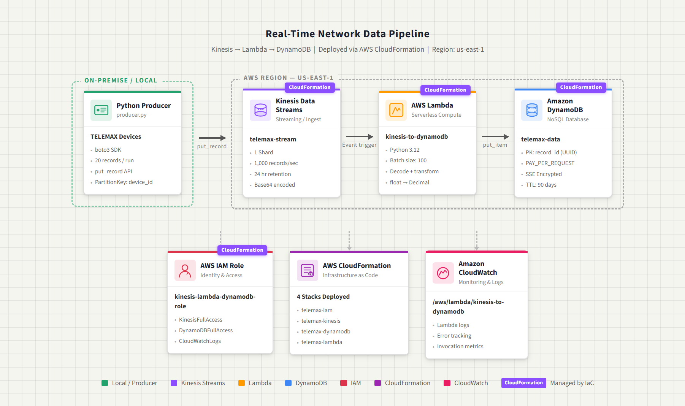

# TELEMAX — AWS Real-Time Data Pipeline

A real-time data pipeline built on AWS for TELEMAX, a telecom company building
networks in underserved markets. Network tower data is captured, processed, and
stored automatically using serverless AWS services.

---

## Architecture



```
Producer (producer.py) → Kinesis Stream → Lambda Function → DynamoDB
```
https://themahipalt.github.io/aws-kinesis-dynamodb-realtime-pipeline/telemax-architecture.html
---

## Services Used

| Service | Resource | Purpose |
|---|---|---|
| Amazon Kinesis | telemax-stream | Ingest real-time data |
| AWS Lambda | kinesis-to-dynamodb | Process and store records |
| Amazon DynamoDB | telemax-data | NoSQL storage |
| AWS IAM | kinesis-lambda-dynamodb-role | Permissions |
| AWS CloudFormation | 4 stacks | Deploy all infrastructure |
| Amazon CloudWatch | Lambda log group | Monitoring and logs |

---

## Folder Structure

```
aws-kinesis-dynamodb-realtime-pipeline/
├── producer/
│   └── producer.py
├── lambda/
│   └── lambda_function.py
├── infrastructure/
│   ├── iam-role.yaml
│   ├── kinesis-stream.yaml
│   ├── dynamodb.yaml
│   └── lambda.yaml
├── architecture/
│   └── architecture-diagram.png
├── screenshots/
│   ├── kinesis-stream.png
│   ├── dynamodb-table.png
│   └── lambda-trigger.png
└── docs/
    └── project-explanation.md
```

---

## How to Run

### 1. Install dependencies

```bash
pip install boto3
aws configure
```

### 2. Deploy infrastructure

```bash
aws cloudformation deploy --template-file infrastructure/iam-role.yaml --stack-name telemax-iam --capabilities CAPABILITY_NAMED_IAM

aws cloudformation deploy --template-file infrastructure/kinesis-stream.yaml --stack-name telemax-kinesis

aws cloudformation deploy --template-file infrastructure/dynamodb.yaml --stack-name telemax-dynamodb

aws cloudformation deploy --template-file infrastructure/lambda.yaml --stack-name telemax-lambda
```

### 3. Send data

```bash
cd producer
python3 producer.py
```

### 4. Verify in DynamoDB

Go to AWS Console → DynamoDB → telemax-data → Explore table items → Run

---

## Data Schema

| Field | Type | Description |
|---|---|---|
| record_id | String | Unique ID (UUID) |
| device_id | String | Tower name e.g. tower-7 |
| signal_strength | Decimal | Signal in dBm |
| bandwidth_mbps | Decimal | Bandwidth in Mbps |
| location | String | City name |
| timestamp | String | Unix timestamp |

---

## IAM Permissions Required

- AmazonKinesisFullAccess
- AmazonDynamoDBFullAccess
- CloudWatchLogsFullAccess

---

## Docs

See [docs/project-explanation.md](docs/project-explanation.md) for full details.
